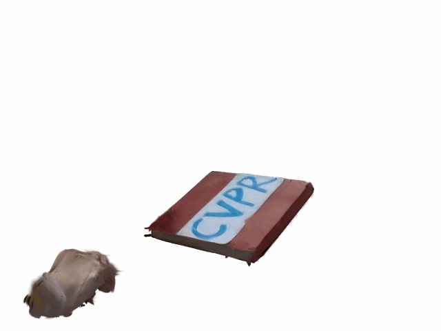
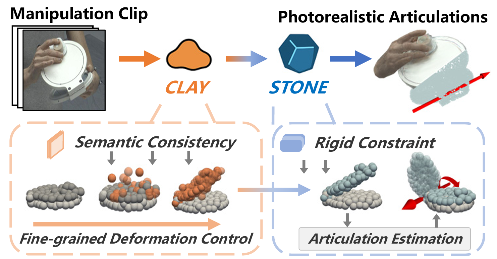
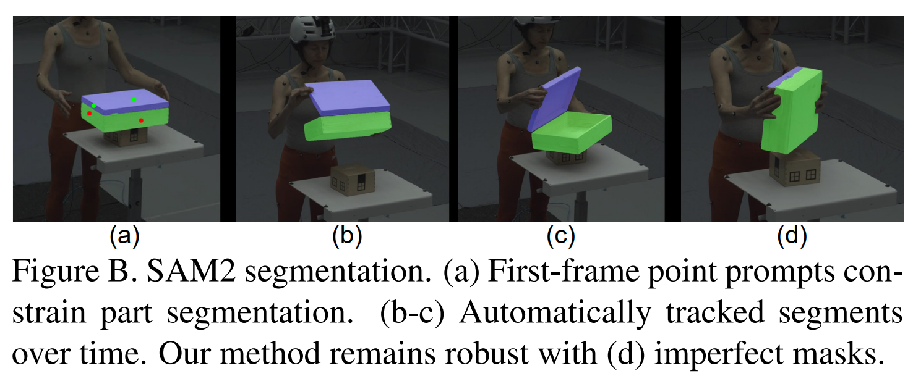
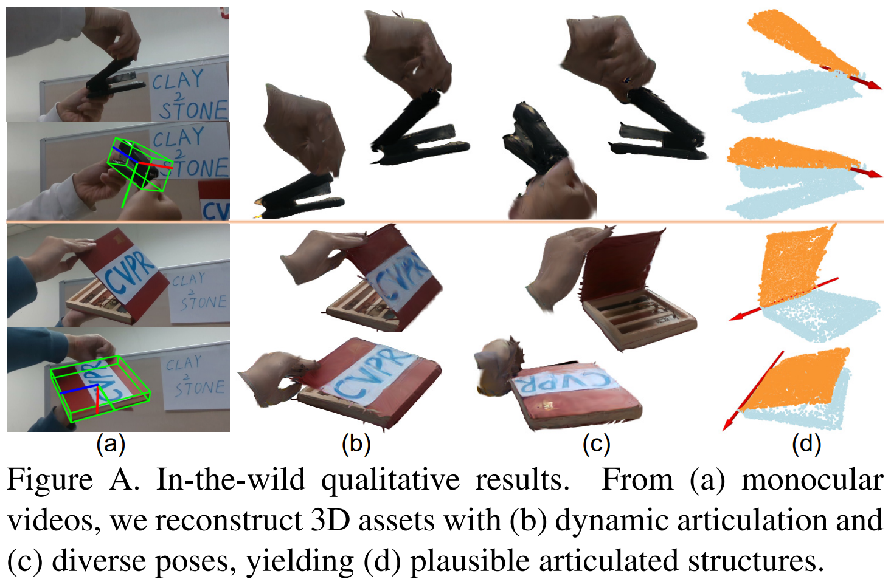

<div align="center"> 

<h1>Clay-to-Stone: Phase-wise 3D Gaussian Splatting for Monocular Articulated Hand-Object Manipulation Modeling [CVPR 2026 Highlight]</h1> 

</div>

<table align="center" style="width:100%;">
  <tr>
    <td align="center" style="width:50%;">
      
      <br>
      <em>In-the-wild Video</em>
    </td>
    <td align="center" style="width:50%;">
      
      <br>
      <em>Renders</em>
    </td>
  </tr>
</table>


<p align="center">
  <a href="https://youtu.be/1SULG-b25Uk"><b>🎥 Video Demo</b></a> |
  <a href="https://openaccess.thecvf.com/content/CVPR2026/papers/Liu_Clay-to-Stone_Phase-wise_3D_Gaussian_Splatting_for_Monocular_Articulated_Hand-Object_Manipulation_CVPR_2026_paper.pdf"><b>📄 Paper</b></a>
</p>


<!-- <p align="center">
  
</p> -->

## Requirements

Refer to [HOGS](https://github.com/ru1ven/HOGS/blob/main/requirements.txt) for CUDA, PyTorch, and other dependencies. Additionally, install [gaussian-splatting](https://github.com/graphdeco-inria/gaussian-splatting.git).


## Dataset Preparation

Preprocess the dataset using `cocoify_arctic.py` and `preprocess_arctic.py` to generate the training and testing splits used in the paper.


Generate part-level object segmentation for articulated sequences using [SAM2](https://github.com/facebookresearch/sam2).


[Here](https://huggingface.co/ru1ven/ArGS/tree/main) are our pre-trained checkpoints and segmented masks on ARCTIC.
<p align="center">
  
</p>

After preprocessing, the dataset should be organized as follows:

```text
arctic/
├── images/
├── masks/
└── splits/
    ├── train/
    │   └── *.npy
    └── test/
        └── *.npy
```

## Training
Run the training script:

```bash
python train_arctic.py 
```
Training configurations can be adjusted in `./configs`. 


## In-the-Wild Demo


The [`Ablation branch`](https://github.com/ru1ven/ArGS/tree/Ablation) contains the code for our ablation studies and the in-the-wild demo. For a monocular articulated manipulation video, the pipeline is as follows:

1. Use [SAM2](https://github.com/facebookresearch/sam2) to extract part-level segmentation of the articulated object.
2. Use [HAMER](https://github.com/geopavlakos/hamer) and [FoundationPose](https://github.com/NVlabs/FoundationPose) to predict hand-object poses. Since FoundationPose can only track rigid objects, static parts (e.g., the base of a stapler) from SAM2 segmentation can be provided as input to extract the corresponding pose. Create the corresponding `splits/*.npy` files following Dataset Preparation.
3. (Optional but recommended) Roughly estimate and initialize the articulated object’s [axis](https://github.com/ru1ven/ArGS/blob/945367421c578d92675cc472f4e16a9aff586f4a/models/deformer/rigid.py#L529). This trick is intentionally omitted in our experiments to keep the evaluation free of such heuristics, but it can improve robustness in practical in-the-wild scenarios.
4. Use `train_wild.py` and `render_wild.py` from the [`Ablation branch`](https://github.com/ru1ven/ArGS/tree/Ablation) to model the articulated objects and render results.

<p align="center">
  
</p>


## Acknowledgement
We thank [3DGS](https://github.com/graphdeco-inria/gaussian-splatting), [3DGS-Avatar](https://github.com/mikeqzy/3dgs-avatar-release), and [ARCTIC](https://github.com/zc-alexfan/arctic) for their great works!
